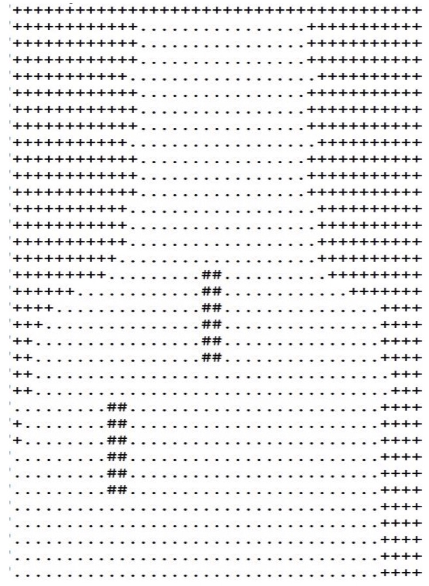

# Exploration and Realtime Mapping of an Obstacle-Prone Unknown Environment Using Swarm of Autonomous Mobile Robots. (Master's Thesis)

This piece of work describes research concerning the application of Swarm Robotics for mapping an unknown area with unknown obstacles. The problem of mapping an unknown environment by a swarm of mobile robots is further divided into two classic problems of Multi-Robot Systems as Multi Robot Area Partitioning Problem and Area Exploration Problem. There is no centralized control. Each robot executes same algorithm in every cycle based on the local information. We solve the mapping problem in two modules. We propose a distributed algorithm for each module and also use concepts from computational geometry. In first module we solve the area partitioning problem where we divide the unknown area among the robots and assign each robot a part of the area. In second module each robot perform exploration of the area assigned and simultaneously generate a topological graph(map) of the sub-area. Thus, by combining graphs of all sub parts of the area we get a map of the area. We simulate our proposed system with [Player/Stage](http://playerstage.sourceforge.net/)(C++ based simulation package) and map is constructed using python graphics library([graphics.py](http://mcsp.wartburg.edu/zelle/python/graphics.py)). 

### Software Simulation :
<iframe width="420" height="315" src="https://www.youtube.com/embed/gN07pcLhqSc" frameborder="0" allowfullscreen></iframe>

###Hardware Simulation(Sub-moodule):
<iframe width="420" height="315" src="https://www.youtube.com/embed/gZDbEwfY8Kg" frameborder="0" allowfullscreen></iframe>

####Hardware Output :

